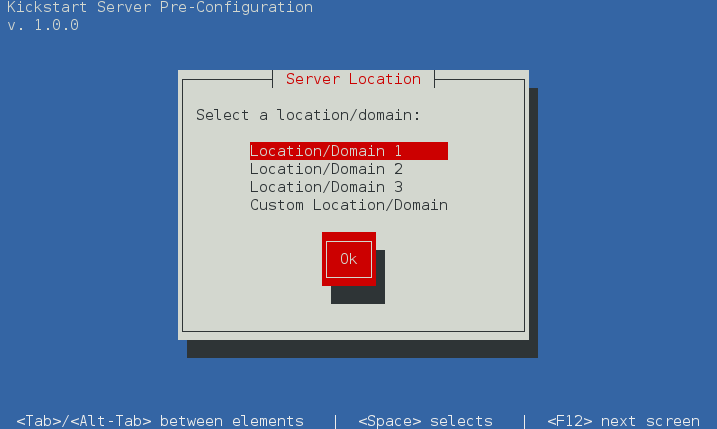

ksconfig
========

### Description:

These scripts were created for use with a kickstart file via %pre and %post sections.
The included scripts will allow you to provide a hostname, IP addressing, as well as 
specify a standard disk partiton/volume configuration with the ability to make size tweaks.

This is especially useful if you would like to kickstart a handful of servers without 
the need of more advanced solutions like cobbler. I have tested these scripts for 
use with CentOS7 but should also be compatible with RHEL and Fedora based linux 
distributions.

### Instructions:

1) Edit the settings within the kspre.py script to suit your needs.

2) View the sample file to include these scripts in your %pre and %post sections 
of your kickstart file.

3) Add *net.ifnames=0*, *biosdevname=0*, and *inst.geoloc=0* to your **boot:** along with your
kickstart file path. 

This ensures that traditional interface names are used. ie: eth0, eth1, etc.

```
linux net.ifnames=0 biosdevname=0 inst.geoloc=0 ks=<path-to-kickstart>
```

### Screenshots

##### Server Location
Specify pre-defined server location/domain. The 'custom' option will prompt 
user for a domain and a short description.
 
(enabled/disabled in kspre.py settings if not needed)



##### Hostname and IP configuration

Second interface is optional. Disable/enable via kspre settings


##### Validate IP's

Do not allow CIDR notation, invalid IP's, or Blank IP fields


##### Select disck for installation of OS


##### Modify default partitioning

Modify partitions of 'standard partitioning' scheme

(standard partitioning scheme can be changed by modifying the script)


##### Verify Configuration


##### Accept configuration or Re-Configure

The 're-configure' option will enable IP validaions if previously skipped


### Author
Blayne Campbell (https://github.com/bcambl)

### License
BSD
